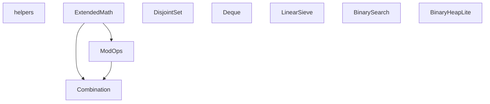

# AtCoder 提出用ライブラリ

Source: [jsr:@ayaexptech/arcane@1.0.0-alpha.7](https://jsr.io/@ayaexptech/arcane)

競技プログラミング（AtCoder）向けの TypeScript ライブラリ集です。各 `.ts` ファイルの内容を提出コードにコピーして使います。

## 使い方

1. [`template.ts`](../../template.ts) から問題用ファイルを作成する（または [`scripts/new-problem.ps1`](../../scripts/new-problem.ps1) を使う）
2. 必要な `.ts` を [lib/](../) からコピーする
3. `InputScanner` クラスの直後、`export {}` より前に貼り付ける

```typescript
class InputScanner {
    // ...
}

// ← ここに lib/*.ts の内容を貼る

export {};
```

## ライブラリ一覧

| ファイル | 説明 | ドキュメント |
|---------|------|-------------|
| `helpers.ts` | 定数・配列ユーティリティ・出力 | [helpers.md](./helpers.md) |
| `ExtendedMath.ts` | GCD、約数、整数平方根、素数判定など | [ExtendedMath.md](./ExtendedMath.md) |
| `ModOps.ts` | 剰余演算（加減乗除・逆元・累乗） | [ModOps.md](./ModOps.md) |
| `Combination.ts` | 二項係数 nCk mod p | [Combination.md](./Combination.md) |
| `DisjointSet.ts` | Union-Find（素集合データ構造） | [DisjointSet.md](./DisjointSet.md) |
| `Deque.ts` | 双方向キュー | [Deque.md](./Deque.md) |
| `LinearSieve.ts` | 線形篩・素因数分解 | [LinearSieve.md](./LinearSieve.md) |
| `BinarySearch.ts` | 二分探索・lower/upper bound | [BinarySearch.md](./BinarySearch.md) |
| `BinaryHeapLite.ts` | 二分ヒープ（優先度付きキュー） | [BinaryHeapLite.md](./BinaryHeapLite.md) |
| `tier2.ts` | 追加候補のメモ（未同梱） | [tier2.md](./tier2.md) |

## 依存関係



### 貼り付け順

| 使うライブラリ | 貼る順序 |
|--------------|---------|
| `Combination` | `ExtendedMath.ts` → `ModOps.ts` → `Combination.ts` |
| `ModOps` | `ExtendedMath.ts` → `ModOps.ts` |
| それ以外 | 単体で OK |

## ローカルテスト

```powershell
cd c:\Users\manami\std\atcoder
Get-Content contests/abc400/tests/a.in | bun run contests/abc400/a.ts
```
